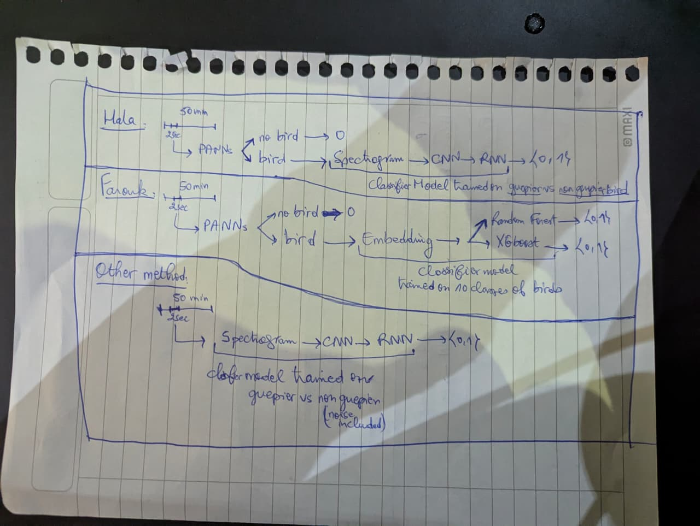

# 🐦 Birds With Sunglasses — Automathon Hackathon 2025

## 🧭 Project Context

This project was developed during a **24-hour hackathon** organized around an ecological challenge proposed by **BWS (Birds With Sunglasses)**, an NGO dedicated to the study and preservation of avian species.

The goal was to **detect the calls of the European Bee-eater** (*Merops apiaster*) in long park audio recordings, in order to study the effect of climate change on the species’ migration patterns.  
The detection results are expected in the form of JSON files listing timestamps where the target bird is present.

The evaluation metric prioritized **recall** (detecting all true Bee-eater calls) over precision, since the species is rare in the recordings.

---

## 🧪 Dataset Overview

The provided dataset consisted of two main parts:

- **bird_songs/** — short recordings of different bird species (including the European Bee-eater and other common birds in Kenyan parks).
- **parc_audios/** — long field recordings with timestamp annotations of Bee-eater calls for training.
- **dataset_validation/** — validation audios (without annotations) for scoring.

Annotations were provided via `timestamps.json`, which specifies the time intervals where the Bee-eater’s calls occur.

---

## 🚀 Our Team & Approaches

Developed by a team of three participants, this repository implements several complementary approaches to improve detection robustness.

### **Approach 1 — Fine-tuned AST Baseline**
Fine-tuning of the **Audio Spectrogram Transformer (AST)** on 3 classes:
- *European Bee-eater*,  
- *Other birds*,  
- *Noise*.

Weighted cross-entropy and focal losses were tested for class imbalance handling.

---

### **Approach 2 — Embedding Alignment + Random Forest**
1. Fine-tune **AST embeddings** using a **self-contrastive loss** to maximize separation between bird species.  
2. Use **PANNs** to detect “bird vs. non-bird.”  
3. Train a **Random Forest classifier** on the refined embeddings to classify the specific bird species.

---

### **Approach 3 — PANNs + CNN-RNN Hybrid**
- Use **PANNs** to identify if an audio segment contains any bird call.  
- Feed positive segments into a **CNN + RNN** classifier trained with focal loss to identify the Bee-eater specifically.

---

### **Approach 4 — (To be described later)**
A fourth experimental method was explored; documentation will be added after code cleanup.

---



## 📁 Repository Structure

```
│
├── json_outputs/              # Model predictions and final JSON outputs
│   ├── pred_timestamps_*.json
│   └── dataset_validation_results.json
│
├── logs/                      # Training and inference logs
│
├── models/                    # Model definitions and training scripts
│   ├── classifier_3rd_method.py
│   ├── finetune_ats.py
│   ├── embedding_align.py
│   ├── my_model_plus_rf.py
│   ├── model_classif.py
│   └── ...
│
├── post_processing/           # Evaluation and JSON conversion scripts
│   ├── compute_f4.py          # F4-score evaluation script
│   └── postp_process_json.py
│
├── preprocessing/             # Audio and dataset preprocessing utilities
│   ├── create_chunks_dataset.py
│   ├── spectrogram_save.py
│   ├── min_end_start.py
│   ├── to_wav.py
│   └── ...
├── explore/              # ipynb files for our first explorations
├── gpu_run.sbatch             # SLURM job submission script example
├── requirements.txt           # Python dependencies
└── 3rd_method_output_json.py  # Example inference script for method 3
```

---

## 🧰 Installation & Requirements

To set up the environment, simply install dependencies using:

```bash
pip install -r requirements.txt
```

We used **Python 3.10+** with GPU acceleration (PyTorch + CUDA).  
Large datasets are **not included** in this repository due to size constraints, but **sample data** will be uploaded later for demonstration.

---

## 🧩 Future Work

- Clean and merge final inference pipelines.
- Add dataset samples and clear instructions for reproducing experiments.
- Benchmark all methods under a unified evaluation script.
- Provide pretrained model weights.

---

## 👥 Authors

**Team AutomATants (CentraleSupélec – Automathon 2025)**
- Rida ASSALOUH 
- Hala CHAFIK
- Farouk YARTAOUI  

---

*“Detecting the unseen — understanding migration through sound.”*
